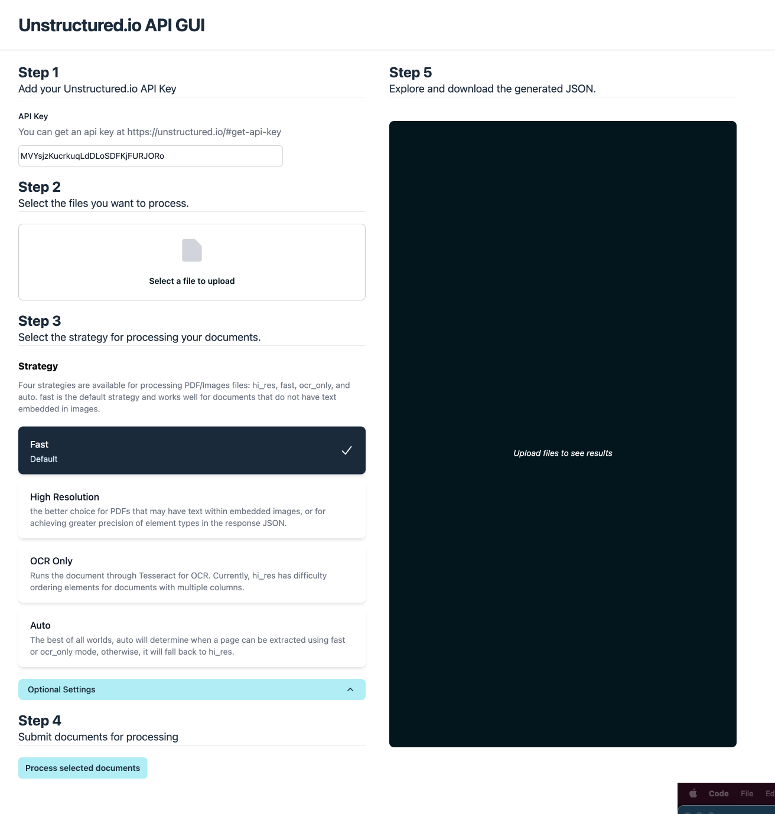

# Unstructured.io GUI
Welcome to my version of a GUI to interact with the [Unstructured.io API](https://unstructured-io.github.io/unstructured/api.html).




This application is built with

- [TypeScript](https://www.typescriptlang.org/docs/)
- [Remix](https://remix.run/docs)
- [Tailwind](https://tailwindcss.com/docs)
- [HeadlessUI](https://headlessui.com/react)
- [Hero Icons](https://heroicons.dev/)

This applicaiton is deployed on Fly.io https://unstructured-ui.fly.dev/

## Requirements
This project requires:
- Node.js version (^14.17.0, or >=16.0.0)
- npm 7 or greater
- Unstructured API Key (which can be acquired [here](https://unstructured.io/#get-api-key))


## Run production build locally

```sh
npm i
npm run build
npm start
```

## Development
To run the application locally 

From your terminal:

```sh
npm i
npm run dev
```

This starts your app in development mode, rebuilding assets on file changes.

## Project Description

### Known Issues
- When submitting multiple documents the stats don't work properly due to the nested array's of data
    - when i have more time I will fix this by adding data to the response indicating how many documents were processed so that the data can be parsed recursively.
### Design
#### Visual / UX
My approach to the design for this application was to emphasize accessibility, simplicity, and usability. I started with a simple form and output area, then added design features to simplify and clarify the form options, and navigate the data. The design is compatible with all modern browsers and all device sizes.

- This design follows best practices for accessibility and meats WCAG2 AA standards
- This design meets best practices from google (see [here](https://pagespeed.web.dev/analysis/https-unstructured-ui-fly-dev/si8rsje9e4?form_factor=mobile))

#### System Architecture
The architecture of this application was developed based on a few factors including the time constraints, and the need to proxy the requests to the Unstructured.io API to avoid issues with CORS. 

I chose to use Remix, Tailwind, and Headless UI because it allowed me to spin up a project that includes a front end application based on React and a simple web server with very little configuration, and a very high level of flexibility to add a more rih feature set based on available time. Additionally Remix application are very easy to deploy on whatever platform you prefer.

I wrote the application using TypeScript purely out of preference for type safety and the developer experience. 

### Future development
When I have more time to add features I will add the following features:
- Improved JSON navigation and visualization
- User profiles
    - Basic auth
    - Ability to save user settings like API Keys
- Persisted history
    - Non authenticated users will have data stored in local storage
    - Authenticated users will have data persisted in a database, and linked to their profile
- Create "projects" to save configurations, data sources and JSON outputs
    - Authenticated users will have the ability to run ad hoc processing as well as creating specific projects that that will store option configuration, files, and output, and provide the ability to return to the project to make tweaks or get the output again without hitting the API again. 
    - Project dasboard showing projects, key data, and status (once queue is implemented)
- Async Queue system
    - Process the documents async using a queue system to provide a better user experience particularly when processing large or many documents.

